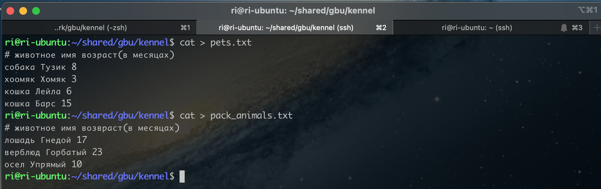
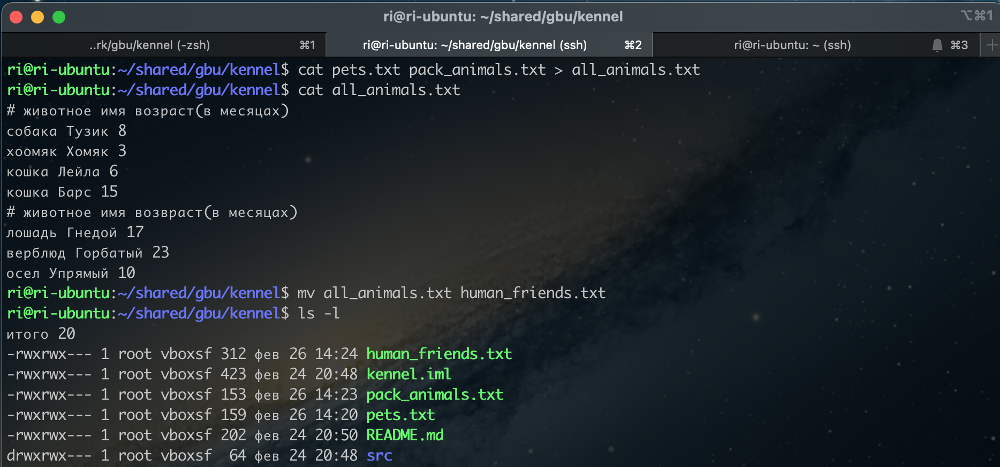
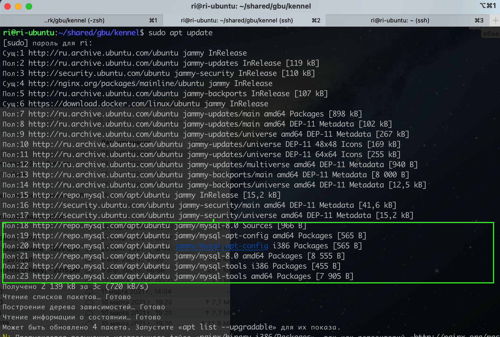
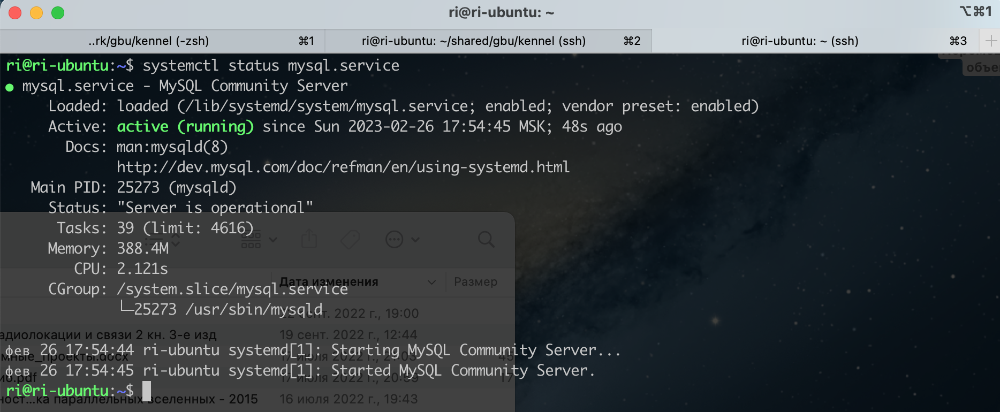
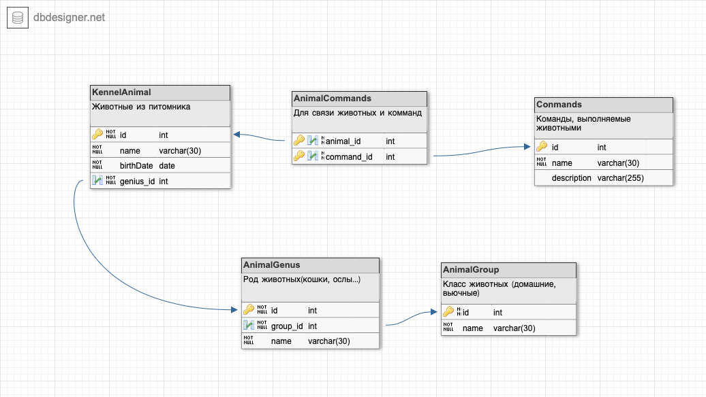

# Итоговая аттестация

### Организуйте систему учёта для питомника, в котором живут домашние и вьючные животные.

1. Используя команду cat в терминале операционной системы Linux, создать два файла 
    Домашние животные (заполнив файл собаками, кошками, хомяками) и Вьючные животными
    заполнив файл Лошадьми, верблюдами и ослы), а затем объединить их. 
    ```shell
        $ cat > pets.txt
        $ cat > pack_animals.txt
        $ cat pets.txt pack_animals.txt > all_animals.txt
    ```
    

    Просмотреть содержимое созданного файла. Переименовать файл, дав ему новое имя (Друзья человека).

    ```shell
        $ cat all_animals.txt
        $ mv all_animals.txt human_friends.txt
    ```
    
    

2. Создать директорию, переместить файл туда
    ```shell
        $ mkdir animal
        $ mv human_friends.txt animal/
    ```

    

3. Подключить дополнительный репозиторий MySQL. Установить любой пакет
   из этого репозитория.
    ```shell
        $ sudo dpkg -i mysql-apt-config_0.8.24-1_all.deb
        $ sudo apt update 
    ```
   
   
   ```shell
      $ sudo apt install mysql-server mysql-client
      $ systemctl status mysql.service
   ```
   

4. Установить и удалить deb-пакет с помощью dpkg.

   ```shell
      $ sudo dpkg -i mysql-apt-config_0.8.24-1_all.deb
      $ sudo dpkg -r mysql-apt-config
      $ sudo dpkg --purge mysql-apt-config
   ```
5. Нарисовать диаграмму, в которой есть класс родительский класс, домашние 
   животные и вьючные животные, в составы которых в случае домашних
   животных войдут классы: собаки, кошки, хомяки, 
   а в класс вьючные животные войдут: Лошади, верблюды и ослы).
   #### Диаграмма классов.   

   
   
   #### ERD - диаграмма

   
   
6. подключенном MySQL репозитории создать базу данных “Друзья человека”

   ```sql
      CREATE DATABASE IF NOT EXISTS HumanFriends;
      USE HumanFriends;
   ```
7. Создать таблицы с иерархией из диаграммы в БД

   ```sql
   CREATE TABLE Commands
   (
       id INT PRIMARY KEY NOT NULL AUTO_INCREMENT,
       name varchar(30),
       description varchar(255)
   );
   
   
   CREATE TABLE AnimalGroup
   (
       id INT PRIMARY KEY NOT NULL AUTO_INCREMENT,
       name varchar(30)
   );
   
   CREATE TABLE AnimalGenius
   (
       id INT PRIMARY KEY NOT NULL AUTO_INCREMENT,
       name varchar(30),
       group_id INT,
       FOREIGN KEY (group_id) REFERENCES AnimalGroup (id)
       ON DELETE CASCADE ON UPDATE CASCADE
   );
   
   CREATE TABLE KennelAnimal
   (
       id INT PRIMARY KEY NOT NULL AUTO_INCREMENT,
       name varchar(30),
       birthDate DATE,
       genius_id INT,
       FOREIGN KEY (genius_id) REFERENCES AnimalGenius (id)
       ON DELETE CASCADE ON UPDATE CASCADE
   );
   
   CREATE TABLE AnimalCommands
   (
       animal_id INT NOT NULL,
       command_id INT NOT NULL,

       PRIMARY KEY (animal_id, command_id),
       FOREIGN KEY (animal_id) REFERENCES KennelAnimal (id)
        ON DELETE CASCADE ON UPDATE CASCADE,
       FOREIGN KEY (command_id) REFERENCES Commands (id)
        ON DELETE CASCADE  ON UPDATE CASCADE
   );
   ```
8. Заполнить низкоуровневые таблицы именами (животных), командами которые они выполняют и датами рождения
   
   ```sql
    USE HumanFriends;

   INSERT INTO commands(name)
   VALUES
    ('Принести тапки'),
    ('Вертеться в колесе'),
    ('Галоп!'),
    ('Поклон!'),
    ('КАШ!');
   
   INSERT INTO AnimalGroup (name)
   VALUES
    ('Вьючные животные'),
    ('Домашние животные');
   
   INSERT INTO AnimalGenius (name, group_id)
   VALUES
    ('Лошадь', 1),
    ('Верблюд', 1),
    ('Осел', 1),
    ('Кошка', 2),
    ('Собака', 2),
    ('Хомяк', 2);
   
   INSERT INTO KennelAnimal (name, birthDate, genius_id)
   VALUES
    ('Гнедой', '2021-02-04', 1),
    ('Гнедой_2', '2022-12-01', 1),
    ('Тупица', '2020-08-24', 3),
    ('Рыжий', '2022-05-20', 2),
    ('Песик', '2023-01-24', 5),
    ('Хомяк', '2022-12-20', 6),
    ('Эльза', '2022-07-12', 4);
   
   INSERT INTO AnimalCommands (animal_id, command_id)
   VALUES
    (1, 3), (2, 3), (2, 4), (3, 4),
    (4, 5), (5, 1), (5, 4), (6, 2),
    (7, 1);
   ```
9. Удалив из таблицы верблюдов, т.к. верблюдов решили перевезти в другой
   питомник на зимовку. Объединить таблицы лошади, и ослы в одну таблицу.
   ```sql
      USE HumanFriends;
      DELETE FROM KennelAnimal WHERE genius_id = 2;
   
      CREATE TABLE HorseAndDonkey AS
	  SELECT * from KennelAnimal WHERE genius_id = 1
      UNION
      SELECT * from KennelAnimal WHERE genius_id = 3;
   ```
10. Создать новую таблицу “молодые животные” в которую попадут все
    животные старше 1 года, но младше 3 лет и в отдельном столбце с точностью
    до месяца подсчитать возраст животных в новой таблице

   ```sql
      CREATE TABLE YoungAnimals AS
         SELECT id, name, birthDate, 
         datediff(curdate(),birthDate) DIV 31 as age, genius_id 
         from KennelAnimal 
         WHERE date_add(birthDate, INTERVAL 1 YEAR) < curdate() 
               AND date_add(birthDate, INTERVAL 3 YEAR) > curdate();
   ```
11. Объединить все таблицы в одну, при этом сохраняя поля, указывающие на
    прошлую принадлежность к старым таблицам.
   ```sql
      SELECT id, name, birthDate, genius_id FROM HorseDonkey
      UNION
      SELECT id, name, birthDate, genius_id FROM YoungAnimals;
   ```